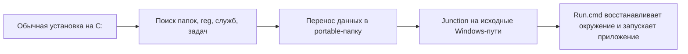

# Club Portable Linker

[](#требования)
[](#сборка-из-исходников)
[](#быстрый-старт)
[](#зачем-это-нужно)

Настройщик portable-сборок для компьютерных клубов, бездисковых систем и серверных игровых библиотек. Интерфейс на русском.

Программа переносит данные приложения с системного `C:` на выбранный диск или сетевое расположение, а на исходных Windows-путях создает junction-ссылки. Для лаунчера все выглядит так, будто он установлен как обычно, но фактически его папки, registry, службы, задачи и запускатель живут в управляемой portable-папке.

Фокус проекта: меньше ручного конфига, больше авто-сбора, GUI на русском, понятный `Run.cmd`, захват reg после установки игр и готовые сценарии для сетевых и бездисковых окружений.

## Что Нового

### 2026-06-05 (большой аудит: 25+ исправлений по движку, реестру, UI и CLI)
**Движок / данные (критичное):**
- **robocopy `/XJ`**: перенос больше не заходит ВНУТРЬ junction/symlink — раньше `/MOVE` мог удалить данные ЦЕЛИ ссылки (например, другой пакет на D:) или зациклиться; проверка «остатка» тоже не следует в reparse-точки.
- **Домерживание после сбоя**: если прошлый перенос упал на середине, остаток источника теперь ДОмерживается в пакет (раньше тихо уезжал в `_Replaced` — пакет оставался неполным).
- **Висячий junction**: применение ссылок больше не падает на битой ссылке (снимается через GetAttributes/Directory.Delete, а не Exists).
- **Не-корневой батч** (BlueStacks `.portable\Tools\*.cmd`): `PORTABLE_ROOT` считается от реального расположения файла, все пути в шаблоне через `%PORTABLE_ROOT%` — раньше такой батч сносил живые junction'ы и пересоздавал их на несуществующие цели.
- **`:relink` с контролем**: если ссылка не создалась (папка занята) — явная ошибка + `relink-errors.log`, а не тихий запуск с записью на C:.
- **Элевация на путях с апострофом** (`D:\Mike's Games`): путь передаётся через env-переменную.
- **Узкие матчи платформ**: «Battlefield» больше не подтверждает Battle.net, «Rocket League» — Riot, «SteamWorld» — Steam (раньше установленный чужой лаунчер физически утаскивался в пакет).
**Реестр:**
- **Вендор-вайтлист с привязкой к платформе**: Steam, работающий в фоне при захвате игры Ubisoft, больше не протаскивает свои ключи в пакет (вторая дыра той же контаминации).
- **Стоп-слова в токенах захвата игры**: «EVE Online» не тянет чужие ключи по токену «Online»; слэши `D:/Games` vs `D:\Games` нормализуются (раньше путь не матчился).
- **Родители-контейнеры блокированы**: ветка `Uninstall`/`Classes` целиком больше не экспортируется (раньше — uninstall-записи ВСЕГО софта в пакет).
- **Игра без снимка находится по веткам лаунчеров** (`Ubisoft\Launcher\Installs`, `GOG.com\Games`, EA…): value-поиск по пути установки.
- CLI: `--reg-capture --game-folder "D:\Games\<игра>"` — захват по папке теперь доступен и из консоли.
**UI:**
- Краш при закрытии окна во время фоновой операции устранён (guard в лог-колбэках).
- «Вечный» оверлей прогресса при клике во время другой операции — закрывается.
- Список «Платформы-лаунчеры» и каталог пакетов заполняются сразу при старте (раньше — пустые до ручного скана).
- «Проверить» в каталоге не проверяет ПРЕДЫДУЩИЙ пакет при неудачном открытии; повторный reg-захват без нового снимка предупреждает (снимок одноразовый, сбрасывается).
**CLI:**
- `--mode 99` и подобное — ошибка, а не тихий «успех без работы»; `--pack` падает, если Run.cmd не записан; `--capture-delta` при отказе от `--apply` возвращает 2; `--export-zip --force` возвращает 0 при созданном ZIP; `--apply-recipe` уважает `--safe`/`--mode` и НЕ перезаписывает существующий пакет без `--force`; `--reg-capture` с несуществующим снимком — ошибка; рецепты: camelCase-JSON читается, пустой/безымянный рецепт отклоняется; null-поля правленного манифеста не роняют CLI.

### 2026-06-04 (выверена клубная схема: игра видна на бездисковом клиенте)
- На реальном кейсе (Ubisoft Connect + Assassin's Creed Syndicate) подтверждена сквозная схема для CCBOOT/бездиска:
  - **лаунчер — портабл на D:** (`D:\Programs\<Лаунчер>`, junction C→D), логин и данные на D;
  - **игра — на общем игровом диске `D:\Games`** (переобраз клиента его не трогает);
  - **регистрация игры затаскивается в reg пакета** (напр. `HKLM\…\Ubisoft\Launcher\Installs\<id>` с `InstallDir=D:\Games\<игра>`).
- На клиенте `Run.cmd` пересоздаёт junction'ы + импортирует reg → лаунчер видит игру в «Installed» и запускает её с `D:\Games`. Проверено симуляцией чистого клиента (удалить ветку игры → импорт reg пакета → ветка вернулась → игра в лаунчере) и реальным запуском игры.
- **Важно:** на КАЖДУЮ новую игру нужен один прогон reg-захвата (`--reg-capture` / вкладка «③ Игры и reg»), иначе на клиенте появится лаунчер без этой игры. `--reg-capture` ловит путь установки из значения `InstallDir` (т.е. матчит игру и по её папке в `D:\Games`).

### 2026-06-04 (багхант: утечка чужих лаунчеров через generic-токен)
- **Папка-контаминация исправлена**: если папка-источник заканчивается родовым словом (напр. `…\Rockstar Games\Launcher`), токен «launcher» матчил ВСЕ чужие лаунчеры — в пакет Rockstar утягивались данные Epic, Ubisoft, Star Citizen (rsilauncher, +312 МБ), DayZ, Unreal. Причина: `AddTokenSet` добавлял полное значение/сжатую форму в обход стоп-листа. Теперь токен, который сам является стоп-словом, не добавляется (многословные имена вроде «Ubisoft Game Launcher» специфичны и остаются). Проверено: Rockstar-preview 10 папок→4 свои, Ubisoft без регресса.

### 2026-06-04 (багхант на реальных установках: .bak-мусор и вложенные ссылки)
- **`.bak.<число>`-папки больше не попадают в портабл**: бэкапы, которые `:relink` создаёт при перепривязке junction (напр. `Ubisoft.bak.9398` на 348 МБ), раньше распознавались как «связанные папки» по имени и тащились в пакет — раздувая его и плодя мусор. Теперь отсекаются (`IsRelinkBackup`).
- **Схлопывание вложенных ссылок**: если одна папка лежит ВНУТРИ другой (напр. `…\Ubisoft` и `…\Ubisoft\Ubisoft Game Launcher`), в план попадала и родительская, и вложенная — это давало junction-внутри-junction и двойной перенос. Теперь оставляется только родительская (и в `DiscoverRelatedDirectories`, и в `Deduplicate`).
- Найдено на реальной сборке Ubisoft Connect: было 7 «папок» (993 МБ, с .bak и дублями) → стало 3 чистых (ProgramData\Ubisoft, ProgramFilesX86\Ubisoft, LocalAppData), reg только Ubisoft+Uplay.

### 2026-06-04 (полировка UI: углы кнопок, шапка, иконка exe)
- **Убраны «чёрные боксы» в углах скруглённых кнопок**: кнопка теперь физически скруглена через `Region` — углы реально вырезаны, сквозь них виден настоящий фон родителя (в т.ч. **градиент** шапки/сайдбара) пиксель-в-пиксель. Раньше углы заливались плоским цветом поверх градиента и выглядели как тёмные квадраты.
- **Шапка выровнена**: логотип-плитка и заголовок центрируются по одной линии; подзаголовок больше **не срезается** снизу (высота шапки 78→86, заголовок 15→14pt, явный шрифт подзаголовка).
- **Иконка .exe больше не «битая»**: кадры `.ico` <256px переведены с PNG-in-ICO на классический 32bpp **BMP/DIB** (256px остаётся PNG). PNG-in-ICO для мелких размеров часть контекстов шелла (диалог «Свойства», мелкие виды проводника) рисовала мусором — теперь лого чёткое везде.

### 2026-06-04 (надёжность Run.cmd/reg, reg игры по пути, отчёт сборки, UX)
- **Run.cmd `:relink` чинит ВИСЯЧИЙ junction** (target-диск пропадал/переезжал): снимает любую reparse-точку через `fsutil … && rmdir`, затем move реальной папки в `.bak`, затем mklink. Раньше битую ссылку не лечило.
- **Reg без кросс-контаминации**: спец-ветки реестра экспортируются только для ПОДТВЕРЖДЁННЫХ платформ (лаунчер реально найден); generic-экспорт блокирует ключи чужих вендоров (Valve\Steam и т.п.). Устранена утечка reg Steam в пакет Ubisoft.
- **Reg игры по пути папки**: на вкладке «Игры и reg» поле «Папка игры» — имя подставляется автоматом, reg матчится и по имени, и по пути установки (`InstallLocation=…`).
- **Отчёт сборки** `.portable\build-report.txt`: что перенесено, reg, запуск, предупреждение если пакет на C:.
- **CLI→UI**: «Из общей папки» (update-recipes --shared) на вкладке «Шаблоны».
- **UX**: навигация с шагами ①②, единая терминология «Шаблоны», «Способ A/B» по сценарию, ⚠-цвет необратимой «Сделать всё»; защита от сборки в чужую непустую папку; сброс stale-конфига при ручной смене пути.

### 2026-06-03 (ночной авто-тест + диск-агностичность)
- **Ночной авто-тест** (`ops/nightly_test.ps1`, задача `ClubPortableLinker-Nightly`, ежедневно 04:00): сборка из исходников (регрессии), `--verify-package` всех пакетов, отчёт + `LAST_STATUS.txt` + уведомление при проблемах. Живёт в `%ProgramData%` — **не зависит от игрового диска**.
- **Диск-агностичность**: автоподстановка «Куда собрать» берёт несистемный том с макс. свободным местом (D:/E:/любой, не хардкод C:); ночной тест ищет пакеты на **всех** фиксированных дисках. Платформа/игра на E: — подхватывается везде.

### 2026-06-03 (запуск из реального расположения пакета)
- **Run.cmd теперь запускает программу из РЕАЛЬНОГО расположения пакета** (`%~dp0…` = тот диск, где лежит пакет — D:/E:), а не по исходному пути `C:\Program Files\…` через junction. Если exe/рабочая папка попадают под Source ссылки — путь переписывается на её Target внутри пакета (`MapThroughLinks`). На образном ПК сразу видно, где физически платформа/игра, и запуск не зависит от целостности junction. (Junction C:→D: остаются — это и есть «указатель, где лежит».)

### 2026-06-03 (каталог платформ в окне)
- **Новая вкладка «Платформы»**: список всех изученных лаунчеров с авто-проверкой, какие **установлены на этом ПК** (✓ + путь). Кнопки: **«Сканировать ПК»** (авто-скан установленных), **«Найти и собрать»** (подставляет найденную папку на вкладку «Сборка»), **«Сохранить как рецепт»** (делает переносимый рецепт `recipes\<Имя>.json` с env-токенами `%ProgramFiles%` — без переноса данных). Единый список-источник правды для 17 платформ.
- **Мастер «добавить игру»**: кнопка «1. Снимок reg» теперь проверяет, открыт ли пакет и вписано ли имя игры, и показывает пошаговую инструкцию (снимок → установка → сохранить reg игры).
- Health-check пакета (целостность junction, наличие reg, target не на C:) — кнопка **«Проверить»** на вкладках «Пакет» и «Каталог».

### 2026-06-03 (RU-лаунчеры)
- **Добавлены RU-лаунчеры из реальной библиотеки клуба**: **Lesta Game Center** (Мир танков/кораблей/Blitz, `lgc.exe`), **BattleState Games** (Escape from Tarkov / Arena, `BsgLauncher.exe`), **VK Play** (Warface, STALCRAFT, Lost Ark…), **4game / Innova** (Lineage II, Aion, Black Desert, PointBlank). Для каждого — ссылки на папки лаунчера/данных, запуск и экспорт нескольких кандидатов веток реестра (экспортируются только реально существующие).

### 2026-06-03
- **Авто-поддержка новых лаунчеров при сборке**: **Ubisoft Connect**, **GOG Galaxy**, **Rockstar Games** (Launcher + Social Club), **Wargaming Game Center** (WoT/WoWs). Линкер сам распознаёт платформу, добавляет папки лаунчера и данных, запуск и экспорт нужных веток реестра (`Ubisoft`, `GOG.com`, `Rockstar Games`, `Wargaming.net`). Для Ubisoft это критично: без `HKLM\...\Ubisoft\Launcher\InstallDir` Connect «теряет» себя после переобраза.
- **Спец-ключи реестра Steam** (`Valve\Steam` — `SteamPath`/`InstallPath`): теперь экспортируются при сборке Steam, а не ловятся только общим поиском.

### 2026-05-31
- **Подчищены MED/LOW по аудиту**: RAGE-MP pre-run удаляет локальные client_resources только если robocopy не упал (нет потери при сбое сети); занятый/битый `bluestacks.conf` не роняет сборку (try); `%` в пути службы экранируется в Run.cmd; в гайде — заметка о доверии к `.reg` (импортируются с правами админа).
- **Каталог: модель «папки поиска»** — кнопка «Добавить папку» (у каждого сервера своя раскладка), запоминается; папки собранных/открытых пакетов запоминаются сами; скан внутри них в фоне. (Вместо медленного слепого обхода всех дисков.)
- **Надёжность по итогам сквозного аудита**: движок переноса не трогает данные при `source==target`/вложенности путей и не линкует на системные пути; неполный robocopy-перенос (занятые файлы) → явная ошибка, а не тихая потеря под junction; `BuildFromPortableLayout` не копирует папку саму в себя; `--capture-delta --apply` без `--game` требует `--yes` (не утащит посторонние папки); путь с `%` в ссылке пропускается (не ломает `:relink`); `SafeEnumerateExe` не идёт по junction (нет зацикливания при повторной сборке); рецепт с null-полями не роняет; фоновые сканы не падают при закрытии окна; прогресс ZIP троттлится.
- **Рецепты упрощены до локальных**: вкладка показывает рецепты из `recipes\` рядом с exe (Создать из пакета / Применить / Папка рецептов); сетевые кнопки убраны. Перенос на другой сервер — копией папки линкера; подтянуть из общей папки — CLI `--update-recipes --shared`.
- **Встроенная авто-поддержка Epic Games / Battle.net / EA App при сборке** (как для Steam/Riot): линкер сам распознаёт платформу, добавляет нужные папки (лаунчер с играми внутри + данные), запуск лаунчера и экспорт веток реестра (Epic Games / Blizzard Entertainment / Electronic Arts). Игры, установленные внутри папки лаунчера, переезжают автоматически. Игры на отдельных дисках/в отдельных папках (D:\SteamLibrary, отдельные Program Files папки Battle.net) намеренно НЕ переносятся (на клубном диске их держат на месте) — добавляются вручную при необходимости.
- **Готовые рецепты Epic / Battle.net / EA** в комплекте (папка `recipes\`): нужные папки (ProgramFiles/ProgramData/LocalAppData с env-токенами `%ProgramFiles%` и т.п. — переносимы между машинами и пользователями) + запуск лаунчера. Применил рецепт → пакет готов. Игры внутри папки лаунчера переезжают автоматически (junction всей папки).
- **Версии рецептов с откатом**: при перезаписи рецепта прежняя версия сохраняется в `recipes\_history` — если обновление что-то сломало, откат из истории. Подтянуть из общей папки — CLI `--update-recipes --shared` (с бэкапом).
- **Надёжность рецептов**: чтение списка — в фоне (UI не зависает); если рядом с exe нет прав на запись (Program Files) — рецепты уходят в `%LOCALAPPDATA%\ClubPortableLinker\recipes`.
- **Рецепты приложений (переносимые шаблоны).** Рецепт — сохранённый шаблон сборки приложения (профиль с токен-путями). Хранится в `recipes\` рядом с exe — **едет с линкером** при переносе сервер→сервер. Вкладка «Рецепты»: «Создать из пакета», «Применить рецепт» (создаёт пакет в выбранной папке), «Папка рецептов». CLI: `--save-recipe`, `--list-recipes`, `--apply-recipe [--apply]`, `--update-recipes`.

### 2026-05-29
- **Чистый старт + понятные кнопки**: поля по умолчанию пустые (без примеров Epic/RAGE), с подсказками-плейсхолдерами; **тултипы на ВСЕХ кнопках** всех вкладок (что делает каждая); «Каталог пакетов» сканирует больше папок (Рабочий стол, `C:\ClubPortable`, рядом с exe, `D:`/`E:` Programs/PortableApps), **обновляется при входе на вкладку** (не нужен рестарт) и счётчик «Пакетов в каталоге» теперь живой.
- **UX по итогам ревью**: подтверждение перед необратимыми «Сделать всё»/«Ссылки» (перенос данных + junction), с понятным текстом; **тултипы на всех кнопках**; «Запуск» переименован в «Пересобрать Run.cmd» (не запускает программу); «Проверить пакет» даёт **итог-вердикт** («исправен» / «проблем N»); ошибки ввода (не выбран пакет/сборка) показываются **окном**, а не строкой в журнале; единый **прогресс-оверлей** для применения/проверки/упаковки; кнопка **«Создать ярлык»** — .lnk на рабочем столе на Run.cmd с иконкой из exe лаунчера.
- **Ещё надёжнее (ред-тим генерируемых батников)**: Stop.cmd передаёт пути закрытия через cmd-переменную, а PowerShell читает `$env` — путь пакета с апострофом (`Mike's Games`) или `&` больше не ломает закрытие процессов; self-heal пропускает ссылку, если источник==цель (защита от самоссылки при кривом пути); аргументы запуска из внешнего `config.ini` чистятся от cmd-метасимволов (`& | < > ^`) — нет инъекции команд.
- **Надёжность по итогам аудита**: `:relink` даёт `.bak` уникальное имя (`%RANDOM%`) — больше нет тихого сбоя `move`, когда `.bak` уже был (это ломало повторные запуски); PreRun-батники пишутся в **UTF-8** (а не ASCII) — кириллица в путях и UNC-шарах (`\СЕРВЕР`, `D:\Игры`) больше не превращается в `?`; упаковка в ZIP не падает целиком из-за одного занятого/длинного файла (пропускает с записью в лог); имя инстанса BlueStacks из внешнего conf санитизируется перед вставкой в Run.cmd.
- **UI: кнопка «Запаковать в ZIP»** — упаковать готовый пакет в архив прямо из окна (в фоне, по готовности открывает папку). Раньше только из CLI.
- **UI: журнал удобнее** — перенос строк (не нужно скроллить вбок), автопрокрутка к свежей записи, авто-сохранение лога каждой сессии в файл (`Logs\session-….log` рядом с exe) и кнопка **«Полный журнал ⤢»** — открывает отдельное масштабируемое окно с полным логом (Копировать всё / Сохранить в файл / Папка лога). Заодно исправлен обрез рядов кнопок на узком окне.
- **Self-heal ссылок переназначает на свой пакет** — `Run.cmd` при каждом запуске через подпрограмму `:relink` гарантирует, что junction указывает именно на ЭТОТ пакет (`%~dp0`): чужую/битую ссылку пересоздаёт, реальную папку-пустышку отодвигает в `.bak`. Решает «Failed to read configuration», битые ссылки и позволяет держать **несколько версий портабла** — переключение двойным кликом по нужному `Run.cmd` (каждый «забирает» ссылки себе). Проверено на 3 случаях: ссылки нет / ведёт не туда / на месте реальная папка.
- **BlueStacks: авто-выбор свежего 64-бит инстанса** — при сборке линкер выбирает самый новый/64-битный инстанс (Android 13/11/9 предпочтительнее Nougat, 64-бит важнее 32-бит), а не первый попавшийся. Современные игры (Brawl Stars и т.п.) требуют 64-бит.
- **BlueStacks: авто-очистка кэша/логов** — `PortablePreRun` теперь перед запуском чистит логи и временные файлы BlueStacks (папки `Logs`, временный `BlueStacks*`), не трогая инстансы и игры. Портабл не пухнет от логов.
- **Дельта-захват докачанных игр** — `--fs-snapshot` (снимок папок ДО) → докачал игру на портабл-платформе → `--capture-delta --package … --snapshot …` показывает **только новые папки** с размерами; с `--apply` переносит их в пакет и ставит junction, дописывает в манифест и пересобирает `Run.cmd`/`Stop.cmd`. Не нужно пересобирать весь пакет. Фильтр `--game <имя>` сужает до конкретной игры.
- **Превью «что попадёт в портабл»** — `--preview --source <папка>` показывает список папок данных с размерами и куда они лягут, ничего не перенося. Видно, что тяжёлое.
- **Новый `Stop.cmd` в каждом пакете** — рядом с `Run.cmd` генерируется выключатель: останавливает службы пакета и закрывает все его процессы (лаунчер + дочерние, запущенные из папок пакета). После него папку можно спокойно перенести или удалить — больше никаких «папка уже используется».
- **Run.cmd ещё проще для ручной правки** — блок прав администратора свёрнут в один `||` (без вложенных `if/else`), а каждая junction-ссылка теперь **одна читаемая строка** `if not exist … mklink …` вместо блока с двумя `if` и скобками. Меньше «if-вложенности» — легче понять и поправить.
- **Run.cmd упрощён** — убран «умный» блок session-state (длинный хэш + state-файл): ссылки просто создаются при запуске, если их нет. Батник стал чище и его легко править вручную.
- **Исправлен импорт reg в `Run.cmd`**: прежняя вложенная конструкция `for … for /r "%%~G"` в cmd находила 0 файлов, из-за чего reg-файлы молча **не импортировались** на клиенте (приходилось применять вручную). Теперь — три явные строки с прямым `for /r`, reg применяется как надо. Пересоберите `Run.cmd` старых пакетов (кнопка «Пересобрать Run.cmd» или `--apply-package --mode Batches`).
- Безопасность и устойчивость применения пакета: значения из манифеста (тип/режим службы, имена служб/задач/окна) проверяются и экранируются при генерации `Run.cmd`/создании служб; расширен список опасных Source-путей (внутрь `Windows` и личных папок ссылки не делаются); `--profile` без значения больше не применяет молча первую сборку; копирование при `--pack` не идёт по junction; у скачивания установщика появился таймаут; путь драйвера BlueStacks берётся из реальной папки установки.
- Новый интерфейс: тёмная тема и тёмный заголовок окна, квадратный логотип-цепь, чистые карточки без лишних рамок, поддержка High-DPI и прокрутка на низких экранах.
- Модель «платформа + игры»: список игр платформы с галочками вкл/выкл; reg игры привязывается к конкретной игре.
- Тяжёлые операции (сборка, скачивание, снимки реестра, проверка) идут в фоне — окно не зависает.
- Надёжнее на бездиске: безопасная запись настроек, перенос между дисками через `robocopy` с проверкой свободного места, устойчивый разбор существующих `.bat`.
- Проверка пакета и самовосстановление `Run.cmd` учитывают вложенные игры.

### 2026-05-27
- Каталог portable-пакетов, drag-and-drop, проверка пакета (`--verify-package`), план (`--plan`), экспорт в zip (`--export-zip`), безопасный режим (`--safe`).
- Читаемый `Run.cmd` с русскими комментариями; session-state для CCBOOT.

### 2026-05-26
- Импорт готового layout с `config.ini`; относительные пути запуска.

## Зачем Это Нужно

В клубной бездисковой схеме `C:` обычно является образом, который раскатывается на много ПК. Если поставить программу обычным способом, она раскидает данные по `Program Files`, `ProgramData`, `%LOCALAPPDATA%`, реестру, службам и планировщику. После переноса на другой ПК платформа часто теряет игры, настройки или сервисы.

Club Portable Linker решает это так:



Итог: на сервере или игровом диске лежит одна переносимая папка, а программа на клиенте продолжает видеть привычные пути.

## Что Умеет

| Возможность | Что делает |
| --- | --- |
| Сбор через установщик | Делает снимок системы, запускает installer, после установки находит новые папки и собирает portable |
| Сбор из готовой папки | Берет уже установленную программу и переносит связанные данные в portable |
| Junction-ссылки | Возвращает исходные пути `C:\Program Files`, `C:\ProgramData`, `%LOCALAPPDATA%`, `%APPDATA%` как ссылки |
| Registry | Экспортирует `.reg`, импортирует их при запуске и умеет захватывать reg игр после установки |
| Один запускатель | Создает один основной `Run.cmd` в корне portable-папки |
| ClientResources | Автоматически ищет `D:\ClientResources\Autorun\cmdow.exe` и поддерживает внешние pre-run скрипты |
| Службы и задачи | Может пересоздавать Windows services и scheduled tasks из portable-папки |
| Спец-профили | Узнаёт лаунчеры (BlueStacks, Steam, Epic Games, Battle.net, EA App, Riot/Valorant, RAGE MP, FACEIT, Ubisoft Connect, GOG Galaxy, Rockstar Games, Wargaming Game Center, Lesta Game Center, BattleState/Tarkov, VK Play, 4game) и добавляет нужные ссылки + ключи реестра сам |
| Рецепты | Переносимые шаблоны сборки (JSON) в `recipes\` рядом с exe — едут с линкером, версии с откатом |
| Stop.cmd | В каждом пакете — корректно закрыть службы и процессы перед переносом/удалением |
| CLI | Позволяет собирать и применять пакеты из PowerShell |

## Подход К Папкам

Готовый пакет обычно выглядит так:

```text
Epic\
  Run.cmd
  ProgramFiles\
  ProgramFilesX86\
  ProgramData\
  Local\
  Roaming\
  Registry\
  .portable\
    manifest.json
    Registry\
```

Главные правила:

- `Run.cmd` — файл запуска, его можно отдавать в shell/ярлык/панель клуба.
- `.portable` — служебная скрытая папка. Пользователю ее трогать не нужно.
- `.portable\manifest.json` — память линкера: какие пути, reg, службы, задачи и batch-файлы входят в сборку.
- `.portable\Registry` — reg-файлы программы и игр, которые импортируются перед запуском.
- `ProgramFiles`, `ProgramFilesX86`, `ProgramData`, `Local`, `Roaming` — вынесенные данные программы (`Local` = `%LOCALAPPDATA%`, `Roaming` = `%APPDATA%`).

> Старые пакеты с папками `UserLocal`/`UserRoaming` продолжают работать: линкер понимает оба варианта.

## Быстрый Старт

> 📖 Пошаговый гайд с примерами (сборка из установленной программы, через установщик,
> платформа+игры, применение на клубном ПК, CLI-шпаргалка) — см. **[GUIDE.md](GUIDE.md)**.

1. Запустите `ClubPortableLinker.exe` от администратора.
2. Введите имя программы: `Epic`, `Steam`, `BlueStacks`, `RSI Launcher`, `Riot Client`.
3. Укажите, куда собрать portable: `E:\Programs\Epic` или `C:\ClubPortable\Epic`.
4. Выберите установщик или главную папку уже установленной программы.
5. Нажмите нужную кнопку сборки.
6. После сборки запускайте программу через `Run.cmd` из portable-папки.

Для рабочего образа лучше собирать пакет на тестовой машине, проверить запуск, а затем переносить на сервер/образ.

## Сценарий 1. Сбор Через Установщик

Этот режим нужен, когда программы еще нет на ПК.

1. Откройте `ClubPortableLinker.exe`.
2. Введите название программы.
3. Укажите portable-папку назначения.
4. В поле `Установщик / URL` выберите `.exe`/`.msi` или вставьте прямую ссылку на installer.
5. Нажмите `1. Снимок + запуск`.
6. Установите программу как обычно. Путь установки можно оставить стандартным на `C:`.
7. Вернитесь в линкер.
8. Если главная папка не нашлась автоматически, укажите ее руками.
9. Нажмите `2. Собрать после установки`.

Линкер перенесет найденные папки в portable-папку и создаст junction-ссылки на исходных местах.

## Сценарий 2. Сбор Уже Установленной Программы

Этот режим нужен, когда программа уже стоит на ПК.

1. Откройте линкер от администратора.
2. Укажите название.
3. Укажите portable-папку назначения.
4. В поле главной папки выберите папку установленной программы.
5. Нажмите `Собрать из папки`.
6. После сборки проверьте `Run.cmd`.

Пример из командной строки:

```powershell
ClubPortableLinker.exe --auto-folder --source "C:\Program Files\Epic Games" --destination "E:\Programs\Epic" --name Epic
```

Безопасный просмотр без переноса файлов:

```powershell
ClubPortableLinker.exe --auto-folder --source "C:\Program Files\Epic Games" --destination "E:\Programs\Epic" --name Epic --no-apply
```

## Сценарий 3. Применение На Игровом ПК

Если portable-папка уже собрана и лежит на диске/сервере:

1. Запустите линкер от администратора.
2. В блоке `Применить или проверить готовую portable-папку` выберите папку пакета.
3. Нажмите `План`.
4. Проверьте, какие ссылки, reg, службы и задачи будут созданы.
5. Нажмите `Сделать все`.
6. После этого запускайте программу через `Run.cmd`.

`Run.cmd` также умеет сам восстанавливать ссылки, импортировать reg и поднимать службы/задачи перед запуском.

## Сценарий 4. Игры Внутри Платформ

Если игра установлена на сервере, но Epic/Steam/EA/RSI на игровом ПК ее не видит, часто не хватает registry или manifest/data-файлов платформы.

Порядок работы:

1. Сначала соберите portable самой платформы.
2. Откройте portable-папку платформы в нижнем блоке линкера.
3. В блоке `Reg-файлы игр внутри платформы` введите название игры.
4. Перед установкой игры нажмите `1. Снимок reg`.
5. Установите игру внутри платформы.
6. После установки нажмите `2. Сохранить reg игры`.

Файлы попадут сюда:

```text
.portable\Registry\Games\<Название игры>\
```

При запуске платформы через `Run.cmd` эти `.reg` будут импортироваться автоматически.

Важно: у платформ есть не только registry. Например:

| Платформа | Где часто лежит важная информация |
| --- | --- |
| Epic Games | `ProgramData\Epic`, `ProgramData\EpicInstallerTemp`, manifests лаунчера |
| Steam | `steamapps`, uninstall-reg ключи Steam App, пользовательские данные Steam |
| EA App | `ProgramData\Electronic Arts`, `ProgramData\EA Desktop`, app/manifests |
| Battle.net | `ProgramData\Battle.net`, `ProgramData\Blizzard Entertainment` |
| RSI Launcher | `%LOCALAPPDATA%\rsilauncher`, папка `Roberts Space Industries` |
| Ubisoft Connect | `%LOCALAPPDATA%\Ubisoft Game Launcher`, reg `HKLM\...\WOW6432Node\Ubisoft\Launcher` (`InstallDir`) |
| GOG Galaxy | `ProgramData\GOG.com\Galaxy`, reg `GOG.com` |
| Rockstar Games | `Rockstar Games\Social Club`, `%LOCALAPPDATA%\Rockstar Games`, `ProgramData\Rockstar Games`, reg `Rockstar Games` |
| Wargaming Game Center | `ProgramData\Wargaming.net`, `%APPDATA%\Wargaming.net`, reg `Wargaming.net` |

Эти папки должны быть частью portable-пакета, иначе платформа может не увидеть уже скачанную игру.

## Рецепты

### Epic Games Launcher

```powershell
ClubPortableLinker.exe --auto-folder --source "C:\Program Files\Epic Games" --destination "E:\Programs\Epic" --name Epic
```

После установки игры внутри Epic сделайте reg-захват игры. Если Epic не видит игру, проверьте `ProgramData\Epic` и manifests.

### Steam

Сначала лучше смотреть план, потому что Steam может весить сотни гигабайт:

```powershell
ClubPortableLinker.exe --auto-folder --source "C:\Program Files (x86)\Steam" --destination "E:\Programs\Steam" --name Steam --no-apply
```

Если план нормальный, уберите `--no-apply`.

### Riot Client / Valorant

```powershell
ClubPortableLinker.exe --auto-folder --source "C:\Riot Games\Riot Client" --destination "E:\Programs\Riot" --name "Valorant Riot"
```

Если в названии есть `Valorant`, `Run.cmd` добавит запуск:

```text
--launch-product=valorant --launch-patchline=live
```

Также будут учтены `C:\ProgramData\Riot Games` и `%LOCALAPPDATA%\Riot Games`.

### FACEIT

```powershell
ClubPortableLinker.exe --auto-folder --source "C:\Program Files\FACEIT AC" --destination "E:\Programs\FACEIT" --name FACEIT
```

Линкер добавит пересоздание службы `FACEITService` из portable-папки и запуск `faceitclient.exe`.

### BlueStacks

```powershell
ClubPortableLinker.exe --auto-folder --source "C:\Program Files\BlueStacks_nxt" --destination "E:\Programs\BlueStacks" --name BlueStacks
```

Линкер учитывает Program Files, ProgramData, user data, службы и задачи. Если после переноса не грузятся картинки магазина, проверьте сеть, кэш BlueStacks и свежие логи в `.portable\Logs` или в папке данных BlueStacks.

### RAGE MP

```powershell
ClubPortableLinker.exe --auto-folder --source "C:\RAGEMP" --destination "E:\Programs\RAGEMP" --name RAGEMP --sharedresources "\\SERVER\RAGEMP"
```

Запуск:

```powershell
Run.cmd -steam
Run.cmd -epic
Run.cmd -rockstar
```

По умолчанию `client_resources` уходит в:

```text
\\SERVER\RAGEMP\client_resources
```

Для отдельного кэша на каждый ПК:

```powershell
Run.cmd -pcresources
```

Тогда путь будет:

```text
\\SERVER\RAGEMP\%COMPUTERNAME%\client_resources
```

### RSI Launcher

```powershell
ClubPortableLinker.exe --auto-folder --source "C:\Program Files\Roberts Space Industries\RSI Launcher" --destination "E:\Programs\RSI" --name "RSI Launcher"
```

После сборки запускать через `Run.cmd`. Линкер учитывает папку лаунчера и user data.

## ClientResources

Если в клубе есть общая папка:

```text
D:\ClientResources\
  Autorun\
    cmdow.exe
```

`Run.cmd` найдет ее автоматически и скроет окно batch-запуска.

## Ручные Правки Run.cmd

Линкер должен помогать, а не закрывать вам руки. Поэтому `Run.cmd` генерируется понятным текстом: вверху есть шапка с подсказками, дальше идут секции с русскими комментариями — проверка прав администратора, восстановление ссылок, импорт registry, задачи, службы и запуск программы.

Если автоматика что-то не угадала, откройте `Run.cmd` в корне пакета и поправьте команды руками — это обычный batch. Учтите только, что при следующей пересборке пакета линкер перезапишет этот файл. Старую версию он перед перезаписью сохранит сюда:

```text
.portable\BatchBackups\
```

Ссылки чинить вручную не нужно: `Run.cmd` при каждом запуске сам наводит junction на свой
пакет (чужую/битую ссылку пересоздаёт, реальную папку по пути отодвигает в `.bak`).

А если нужно применить пакет без трогания junction-ссылок:

```powershell
ClubPortableLinker.exe --apply-package --package "E:\Programs\App" --safe
```

## Что Можно Удалять

| Файл или папка | Можно удалить? | Комментарий |
| --- | --- | --- |
| `profiles.example.json` | Да | Это только пример, для работы не нужен |
| `README.md` | Да | Но лучше оставить как инструкцию |
| `.portable\manifest.json` | Нежелательно | Нужен линкеру для плана, применения и обновления пакета |
| `.portable\Registry` | Нет, если нужны reg | Тут registry программы и игр |
| `.portable\PortablePreRun.cmd` | Нет, если есть | Спец-логика для BlueStacks, RAGE MP, Launcher.ini; создается только для этих платформ |
| `.portable\BatchBackups` | Да | Бэкапы прежних версий Run.cmd, нужны только для отката |
| `Run.cmd` | Нет | Основной запускатель |
| `ProgramFiles`, `ProgramData`, `Local`, `Roaming` | Нет | Это вынесенные данные программы |

## Проверка Перед Выдачей В Клуб

1. В корне portable-папки есть один основной `Run.cmd`.
2. `.portable` скрыта и содержит `manifest.json`.
3. `Run.cmd` запускается от администратора.
4. Исходные Windows-пути стали junction-ссылками.
5. `.reg` импортируются без ошибок.
6. Платформа видит установленные игры.
7. Если есть служба или античит, пакет переживает перезагрузку.
8. Если используется сетевой ресурс, путь доступен с игрового ПК.

## CLI

```powershell
ClubPortableLinker.exe --auto-folder --source "C:\Program Files\Epic Games" --destination "E:\Programs\Epic" --name Epic
ClubPortableLinker.exe --apply-package --package "E:\Programs\Epic"
ClubPortableLinker.exe --auto-folder --source "C:\RAGEMP" --destination "E:\Programs\RAGEMP" --name RAGEMP --sharedresources "\\SERVER\RAGEMP"
ClubPortableLinker.exe --auto-folder --source "C:\Program Files\Roberts Space Industries\RSI Launcher" --destination "E:\Programs\RSI" --name "RSI Launcher"
ClubPortableLinker.exe --reg-snapshot --snapshot "D:\Temp\before-reg.json"
ClubPortableLinker.exe --reg-capture --package "E:\Programs\Epic" --game "Game Name" --snapshot "D:\Temp\before-reg.json"
ClubPortableLinker.exe --plan --config "E:\Programs\Epic\.portable\manifest.json" --profile Epic
ClubPortableLinker.exe --plan --json --config "E:\Programs\Epic\.portable\manifest.json" --profile Epic
ClubPortableLinker.exe --verify-package --package "E:\Programs\Epic" --json
ClubPortableLinker.exe --export-zip --package "E:\Programs\Epic" --out "E:\Archives\Epic-portable.zip"
ClubPortableLinker.exe --apply-package --package "E:\Programs\Epic" --safe
```

Коды выхода:

| Код | Значение |
| --- | --- |
| `0` | Команда выполнена успешно |
| `1` | Ошибка запуска, чтения manifest или аргументов |
| `2` | Команда выполнена, но найдены проблемы в пакете или применении |

## Сборка Из Исходников

Требования:

- Windows 10/11
- .NET SDK 8
- PowerShell 5.1+

Обычная сборка:

```powershell
dotnet build .\ClubPortableLinker.csproj -c Release
```

Публикация одного exe:

```powershell
.\build.ps1 -Output "C:\Build\ClubPortableLinker" -Zip
```

Или вручную:

```powershell
dotnet publish .\ClubPortableLinker.csproj -c Release -r win-x64 --self-contained true -p:PublishSingleFile=true -p:EnableCompressionInSingleFile=true -p:IncludeNativeLibrariesForSelfExtract=true
```

Дымовой тест CLI (без прав администратора, на синтетической папке — прогоняет `--pack` → `--verify-package` → `--plan --json` → `--export-zip` и проверяет артефакты):

```powershell
powershell -NoProfile -File tools\smoke.ps1
```

## Если Что-то Не Работает

| Симптом | Что проверить |
| --- | --- |
| `mklink`/junction не создается | Запустите линкер от администратора. Проверьте, что source не является обычной занятой папкой. |
| Долгий запуск на CCBOOT | Держите portable-данные на game-disk, не на `C:`. Не делайте ссылки на огромные сетевые деревья, если их можно держать локально на игровом диске. |
| Антивирус удаляет `Run.cmd` | Добавьте доверенное исключение для корня portable-пакета штатными средствами Windows/Defender. |
| Платформа не видит игру | Нужны не только файлы игры, но и registry/manifests/data самой платформы. Сделайте reg-захват игры и проверьте data-папки платформы. |
| `--verify-package` вернул код `2` | Откройте текстовый отчет или `--json`; там будет конкретный отсутствующий файл, reg, exe, service binary или неправильная ссылка. |

## Что Линкер Не Делает

- Не чинит сами игры, лаунчеры, лицензии, аккаунты и серверы платформ.
- Не гарантирует работу любого античита после переноса: драйверы и службы всё равно зависят от конкретной защиты.
- Не подменяет античит-драйверы и не обходит защиту платформ.
- Не делает любую программу «на 100% portable» магически: некоторые приложения жестко привязаны к машине, SID, службам, драйверам или онлайн-валидации.
- Не должен запускаться вслепую на боевом образе: сначала `План`, потом `--verify-package`, потом тест на одной машине.

## FAQ

### Почему нужен администратор?

Junction-ссылки, службы, задачи планировщика и часть registry-операций требуют повышенных прав.

### Можно ли просто запускать `Run.cmd` без линкера?

Да, если пакет уже применен и все ссылки созданы. Но линкер нужен для первичного применения, проверки плана, пересборки `Run.cmd`, добавления reg игр и обновления manifest.

### Можно ли удалить manifest?

Технически можно, если пакет окончательно готов и будет запускаться только через готовый `Run.cmd`. Практически лучше оставить: файл маленький, скрытый, зато позволяет линкеру понимать сборку.

### Почему игра не появилась в лаунчере?

Чаще всего не хватает одного из трех элементов:

- registry игры;
- manifest/data-файлов платформы;
- самой папки игры в ожидаемом месте.

Сначала сделайте reg-захват игры, затем проверьте data-папки платформы.

### Что делать с огромными платформами вроде Steam?

Сначала запускайте `--no-apply`, смотрите план и размер папок. Только после этого применяйте перенос.

## Осторожно

Программа меняет реальные Windows-пути, создает junction-ссылки, импортирует `.reg`, может пересоздавать службы и задачи. Перед массовым применением проверяйте пакет на тестовом ПК.
